# school-dropout-prediction

# Introduction

School dropout is a significant problem that affects education and the socioeconomic development of Brazil. Therefore, understanding the factors that influence school dropout is crucial to developing effective policies that can reduce its rates and improve the quality of education. Using the 2021 school census databases provided by **INEP** (National Institute for Educational Studies and Research Anísio Teixeira) and GDP data from municipalities provided by **IBGE** (Brazilian Institute of Geography and Statistics), the goal is to address the problem of school dropout through artificial intelligence techniques.

The objective of this study is to analyze the various factors that influence the dropout rate in all schools in Brazil, using machine learning and data mining methods. The analysis seeks to identify factors that contribute positively, negatively, or have no significant influence on school dropout. To achieve this goal, two machine learning algorithms were used: Random Forest and Neural Networks.

By using these techniques, this study intends to provide a comprehensive view of the factors influencing school dropout, offering insights for public policy formulation and educational interventions that can effectively combat this problem. The analysis and results obtained may serve as a solid foundation for future research and initiatives aimed at improving the Brazilian educational system.

# Development

## Database Formulation

In the approach executed for the problem, a combination of government databases was made to provide a basis for solving the issue.

### Databases Used

First, to obtain a database containing knowledge about the Brazilian educational system, the integration of the 2021 school census databases on educational indicators of two education levels in the country, high school and elementary school, such as school performance rates and the degree of teacher effort, conducted by **INEP**, and the municipal database provided by **IBGE** for the same year, integrating information such as GDP and municipal per capita GDP into the main database. Each instance represents a school in the national territory, with attributes about the municipality, entity type, and category.

### Data Imputation

To handle missing data in the integrated databases, data imputation was performed using the *KNN* algorithm, with parameter K set to five, considering the objects that belonged to the same national federal unit to obtain a consistent result for the missing attributes in the primitive databases without requiring excessive computational resources and time.

### Target Attribute Development

To ensure the database has a target attribute that encompasses dropout rates in both analyzed education levels, high school and elementary school, the total school dropout rate was calculated based on the number of classes, the average number of students per class, and the dropout rate in each education level. The target attribute was calculated by the following equation:

$$\\frac{Students/Class_{ES} \\cdot Classes_{ES} \\cdot Dropout_{ES} + Students/Class_{HS} \\cdot Classes_{HS} \\cdot Dropout_{HS}}{Students/Class_{ES} \\cdot Classes_{ES} + Students/Class_{HS} \\cdot Classes_{HS}}$$

Thus, the total dropout rates for each educational institution are categorized as follows:

$$
\begin{cases} 
\text{Low} & \text{if } Dropout < 5 \\
\text{Moderate} & \text{if } 5 \leq Dropout \leq 10 \\
\text{High} & \text{if } Dropout > 10 
\end{cases}
$$

## Exploratory Data Analysis

To gain a better understanding of the dataset, an exploratory analysis of the database was conducted.

### Dataset Distribution

To analyze the distribution among school dropout categories, a histogram is used.

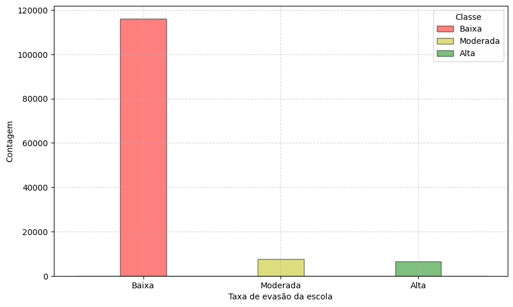

As seen in **Figure 1**, there is a significant imbalance between school dropout categories, with the majority class being the Low category.

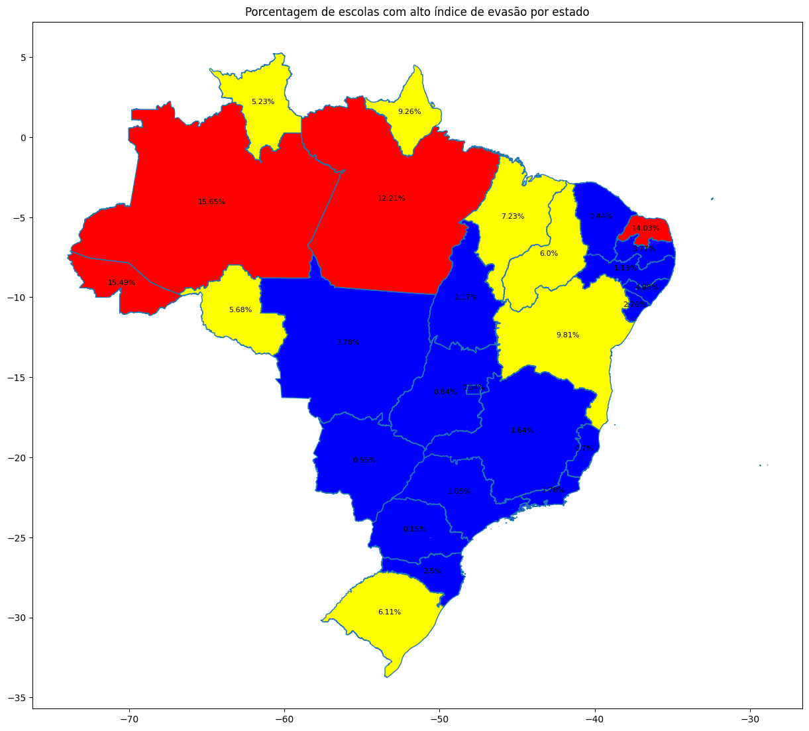

### Heatmap

To observe the correlation of the variables used, a heatmap is used.

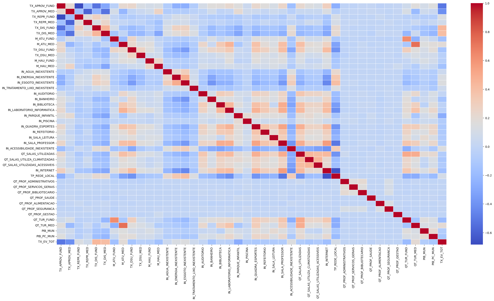

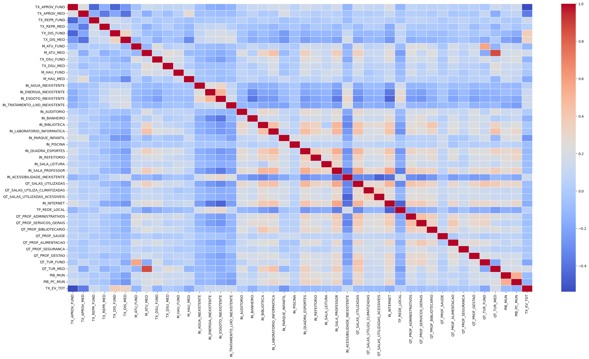

### Scatter Plots

To obtain a more accurate visualization of the correlation between attributes, scatter plots are used.

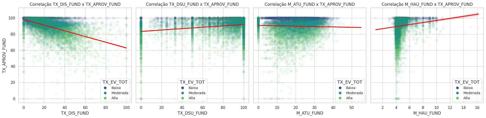

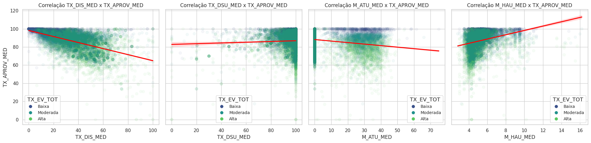

### Violin Plots

To observe the concentration of some attributes among the dataset categories, violin plots are used.

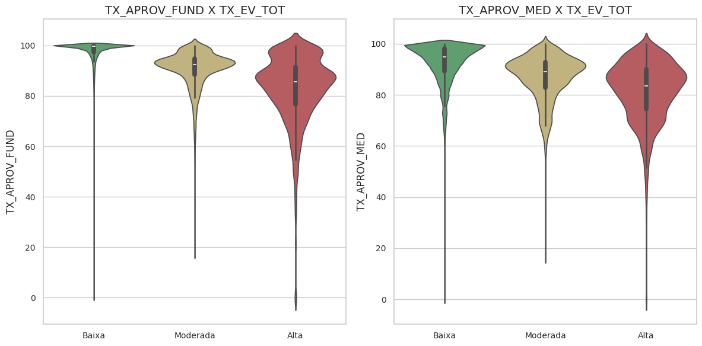

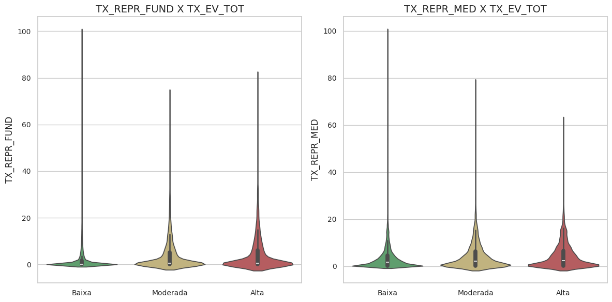

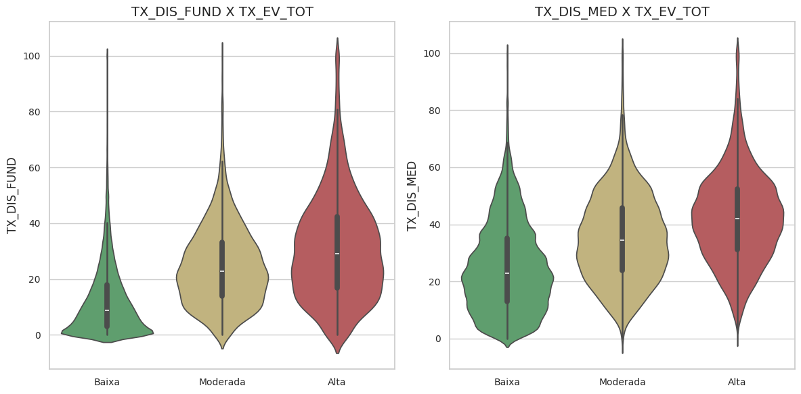

## Modeling

### Sampling

To reduce computational costs and decrease execution time, a sample of about 10% of the total objects was used.

### Random Forest

Random Forest is a machine learning algorithm that aggregates decision trees to improve accuracy. It can be used to classify dropout rates and identify key attributes.

##### Balanced Sample

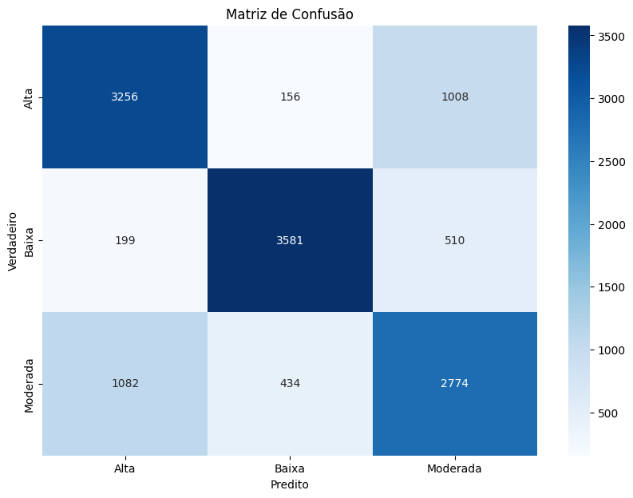

#### Random Sample

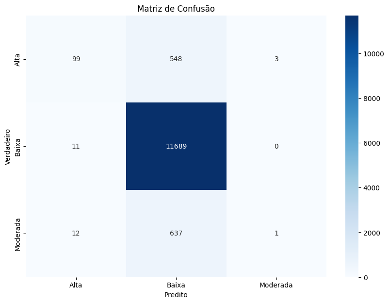

### Neural Networks

Neural networks are models capable of identifying complex patterns and are ideal for predicting school dropout rates with high precision.

#### Balanced Sample

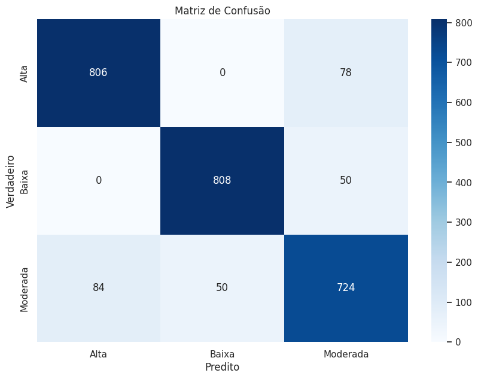

#### Random Sample

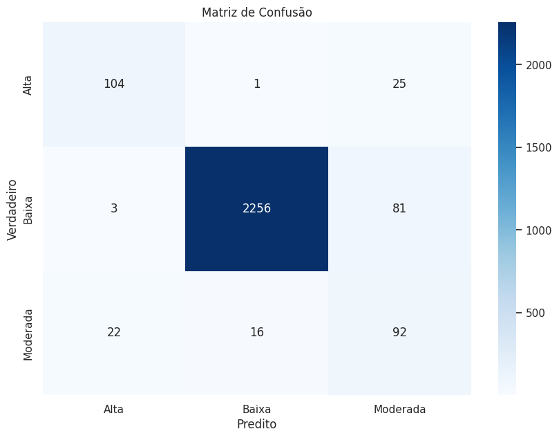

# Conclusion

The study concludes that school dropout is a multi-causal problem requiring holistic approaches to address it effectively. Balanced samples proved more effective for model training, and neural networks offered better generalization compared to Random Forest.
